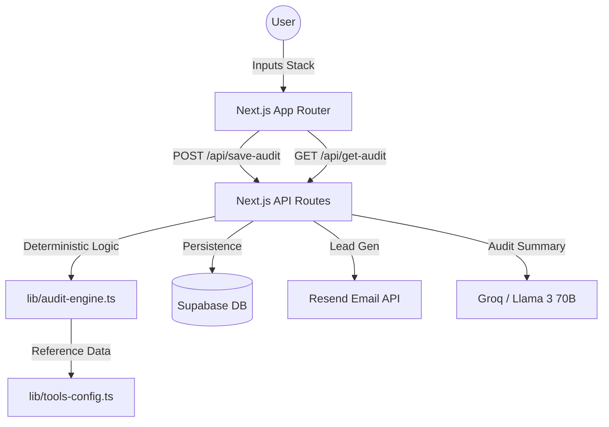

# System Architecture — Credex AI Audit

## System Diagram

## Data Flow

1.  **Ingestion**: User selects their current AI tools, seat counts, and plans.
2.  **Processing**: The `runAudit` function in `lib/audit-engine.ts` executes a series of deterministic rules:
    *   **Plan Fit**: Checks if seat counts justify "Team/Business" tiers.
    *   **Redundancy**: Identifies overlapping capabilities (e.g., Cursor + Copilot).
    *   **Benchmarking**: Calculates spend-per-developer vs. industry peers.
3.  **Augmentation**: The result is sent to Groq (Llama 3 70B) to generate a human-readable "Strategic AI Summary" that highlights the top 3 priorities.
4.  **Persistence**: The final audit is stored in Supabase and assigned a unique ID for sharing.
5.  **Conversion**: High-savings audits trigger a lead capture flow via Resend.

## Tech Stack Choice

*   **Next.js (App Router)**: For seamless SSR, built-in API routing, and superior performance.
*   **Tailwind CSS**: For a custom, premium design system without the overhead of heavy component libraries.
*   **Supabase**: For instant persistence and easy lead management.
*   **Groq (Llama 3 70B)**: For near-instant, high-fidelity AI summaries at a fraction of GPT-4 cost.
*   **Framer Motion**: For the "wow" factor animations that make the audit feel premium.

## Scaling for 10k Audits/Day

To handle a 10x increase in traffic:
1.  **Edge Functions**: Move the `AuditEngine` to Vercel Edge Functions to reduce latency and infrastructure costs.
2.  **Redis Caching**: Cache common tool configurations and AI-generated summaries to minimize database and LLM API calls.
3.  **Queueing**: Implement a message queue (e.g., Upstash QStash) for email notifications and lead processing to ensure API reliability.
4.  **Database Optimization**: Add read replicas for Supabase and optimize indexing on `audit_id`.
5.  **CDN**: Distribute the embeddable widget via a global CDN with aggressive caching of the `embed.js` script.
