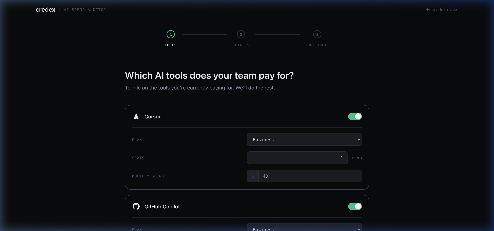
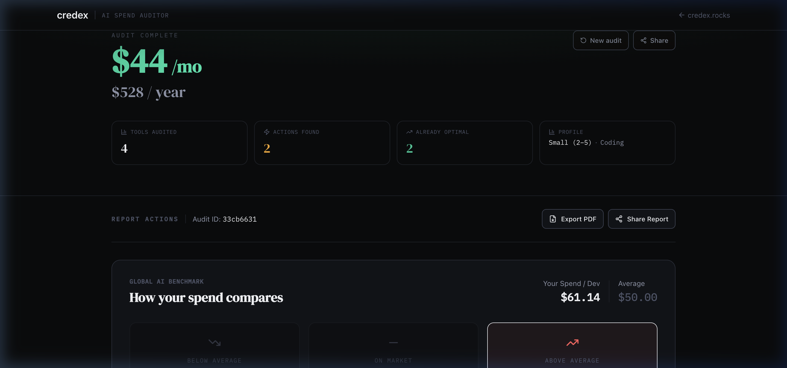
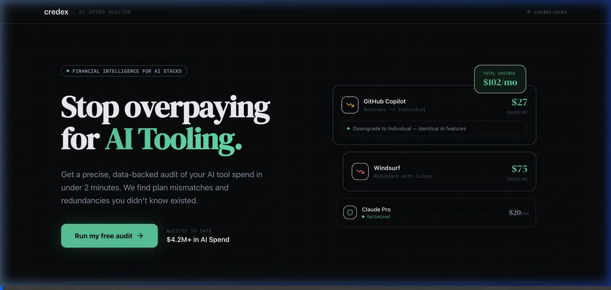

# Credex AI Spend Audit

**Credex AI Audit** is a high-fidelity financial intelligence tool designed for startup founders and CTOs to identify overspend and redundancies in their AI tool stack. It provides a deterministic, step-by-step transition plan to save thousands of dollars in annual subscriptions in under 2 minutes.

---

## 📸 Product Walkthrough

### 1. Interactive Audit Flow
Users select their current stack and configuration through a sleek, multi-step interface that validates seat counts and plan tiers in real-time.



### 2. Strategic Financial Results
The audit generates a comprehensive report featuring a **Global AI Benchmark**, specific **Actionable Recommendations**, and an **AI-powered Strategic Summary**.



### 3. Full App Demo (30s)


---

## ⚡ Quick Start

### Prerequisites
- Node.js 18+ 
- npm or yarn

### Installation
1. **Clone the repository**:
   ```bash
   git clone https://github.com/credex/ai-spend-audit.git
   cd ai-spend-audit
   ```

2. **Install dependencies**:
   ```bash
   npm install
   ```

3. **Set up environment variables**:
   Create a `.env.local` file based on `.env.example`:
   ```bash
   NEXT_PUBLIC_SUPABASE_URL=your_url
   NEXT_PUBLIC_SUPABASE_ANON_KEY=your_key
   GROQ_API_KEY=your_key
   RESEND_API_KEY=your_key
   ```

4. **Run locally**:
   ```bash
   npm run dev
   ```
   Open [http://localhost:3000](http://localhost:3000) to see the results.

---

## ⚖️ Decisions & Trade-offs

1. **Deterministic Logic vs. LLM**: We chose to build the core audit engine using deterministic TypeScript rules instead of LLM calls. **Why?** Financial tools require 100% accuracy and auditability. Hardcoded rules are 0-cost, instant, and impossible to "hallucinate."
2. **Vanilla CSS/Tailwind vs. Component Libraries**: We avoided UI libraries like Material UI or Bootstrap in favor of Tailwind CSS. **Why?** This allowed us to build a unique "Premium Financial" aesthetic with 0% bloat and perfect control over micro-animations.
3. **Client-side State for Forms**: We used `react-hook-form` with `localStorage` persistence. **Why?** It ensures users don't lose their data if they accidentally refresh, without requiring a database hit until the final "Run Audit" step.
4. **Groq (Llama 3) for Summaries**: We used Groq instead of OpenAI for the AI insights. **Why?** The sub-second inference speed makes the report feel "live" and avoids the long loading spinners common in GPT-based apps.
5. **PDF Export via Print Styles**: We used `@media print` CSS rather than server-side PDF libraries (like Puppeteer). **Why?** It's significantly faster for the user, requires 0 extra infrastructure, and ensures the PDF perfectly matches the "premium" on-screen design.

---

## 🌐 Deployment
The app is optimized for Vercel. 
**Deployed URL**: https://credex-two-beige.vercel.app/

---

## Round 2 — Re-audit on Pricing Change

### What was added

The Round 1 tool gave a one-time audit. Round 2 makes audits persistent
and live — users are notified when pricing changes invalidate their results.

**New features:**
- **Persistent audit storage** — every audit saves the pricing snapshot
  used at the time, so changes can be detected later
- **Pricing-change detection** — a detection engine compares stored 
  pricing snapshots against current pricing and flags affected audits
- **Email notifications** — affected users receive a consolidated email
  (one per user, not per audit) with what changed and a re-audit link
- **Diff view** — `/audit/[id]/diff` shows old vs new recommendations
  side by side with a savings delta headline
- **One-click unsubscribe** — `/api/unsubscribe?email=` opts users out
- **Pricing history** — `/changes` shows all pricing versions tracked
- **Admin dashboard** — `/admin` shows total audits, emails sent, 
  click-through rates, and a manual detection trigger

### New routes

| Route | Description |
|-------|-------------|
| `/audit/[id]/diff` | Before/after diff view for a re-audited result |
| `/changes` | Public pricing change history |
| `/admin` | Admin dashboard (HTTP Basic auth) |
| `/api/detect-changes` | POST — triggers pricing change detection |
| `/api/unsubscribe` | GET — one-click email unsubscribe |
| `/api/track-reaudit-click` | POST — tracks diff view click-throughs |

### How to trigger pricing change detection manually

  curl -X POST https://credex-two-beige.vercel.app/api/detect-changes \
    -H "Authorization: Bearer YOUR_CRON_SECRET" \
    -H "Content-Type: application/json" \
    -d '{}'

### New environment variables required

  SUPABASE_SERVICE_ROLE_KEY=   # For admin Supabase operations
  CRON_SECRET=                 # Protects the detect-changes endpoint
  NEXT_PUBLIC_APP_URL=         # Full deployed URL for email links
  ADMIN_PASSWORD=              # HTTP Basic auth for /admin

### Automated scheduling

A GitHub Actions workflow runs pricing detection daily at 09:00 UTC.
Manual trigger also available via the Actions tab on the repository.
